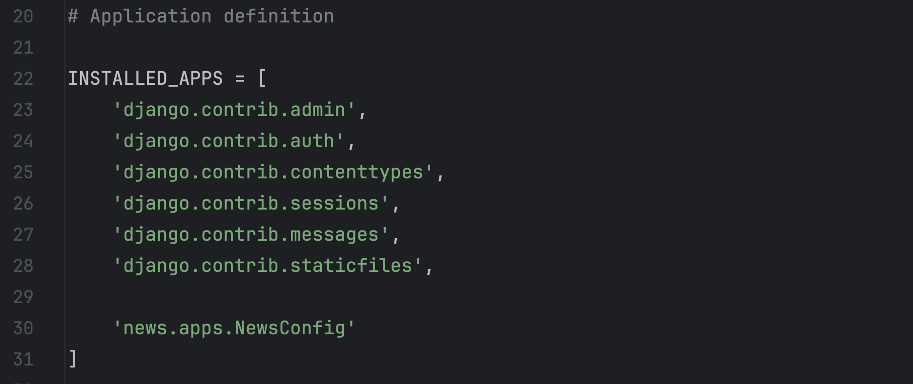

[На главную](/){ .md-button }
##

# Создаем django проект 


## #Подготовка

### Узнать версию python
=== "Mac/Linux"
    ```
    python3 -V
    ```
=== "Windows"
    ```
    python -V
    ```


### Список установленных пакетов pip - `в глобальном окружении`
```
pip list
```


## #Создание проекта

### Создать  виртуальное окружение `в папке проекта`
=== "Mac/Linux"
    ```
    python3 -m venv venv 
    ```
=== "Windows"
    ```
    python -m venv venv 
    ```

### Активировать  виртуальное окружение
```
source venv/bin/activate
```

### Выйти из виртуального окружения
```
deactivate
```

### Устанавливаем django
```
pip install Django
```

### Список команд ядра django
```
django-admin
```

### Создать новый проект
```
django-admin startproject base .
```


### Запустить тестовый вебсервер
=== "v1"
    ```
    python manage.py runserver 
    ```
=== "v2"
    запускаем вебсервер с указанием порта
    ```
    python manage.py runserver 3000
    ```

### Cоздать приложение 
придумайте свое название - `shop, blog`

=== "Mac/Linux"
    ```
    python3 manage.py startapp news 
    ```
=== "Windows"
    ```
    python manage.py startapp news 
    ```

### Добавим новое приложеине в `INSTALLED_APPS`

base  - settings - блок INSTALLED_APPS добавляем строку

```
news.apps.NewsConfig
```


---
## Commands

* `mkdocs new [dir-name]` - Create a new project.
